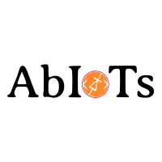

# abiots-things-template v1.0.0

## This is the template for the ESP-IDF projects with components.
This project has default component named TestComponent and its projects can be configured running the menuconfig.

## component configurations:
* Run the menuconfig and in that we would be finding Abiots Test Component. 
* To access the config in the code start with CONFIG_ and we could find all the configurations.

## The CHIP src directory is structured as follows:

| File / Folder | Contents                                           |
| ------------- | -------------------------------------------------- |
| app           | Project Directory                                  |
| images        | Project Images Directory                           |
| components    | All the Abiots Components                          |
| lib           | Abiots Core library                                |
| test          | Test code                                          |
| src           | Main component Directory                           |
